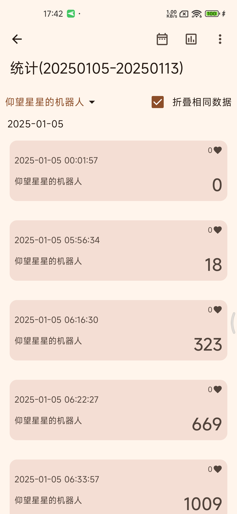
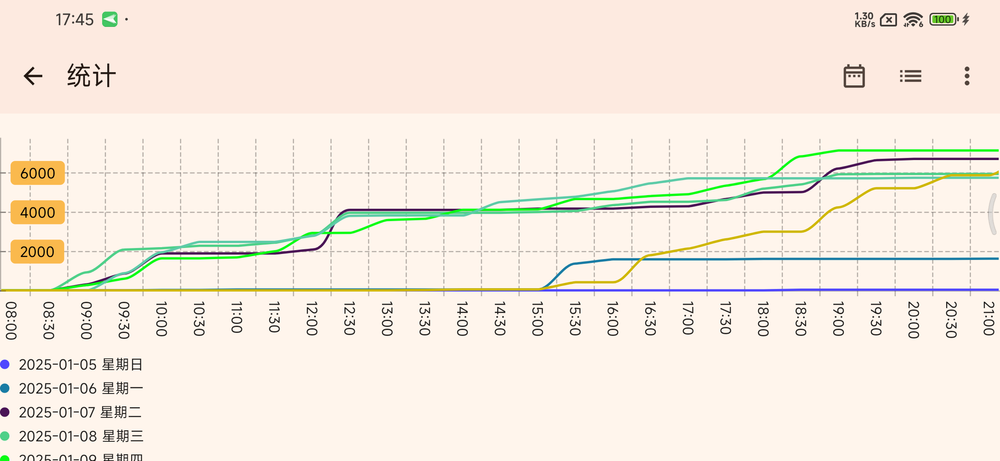
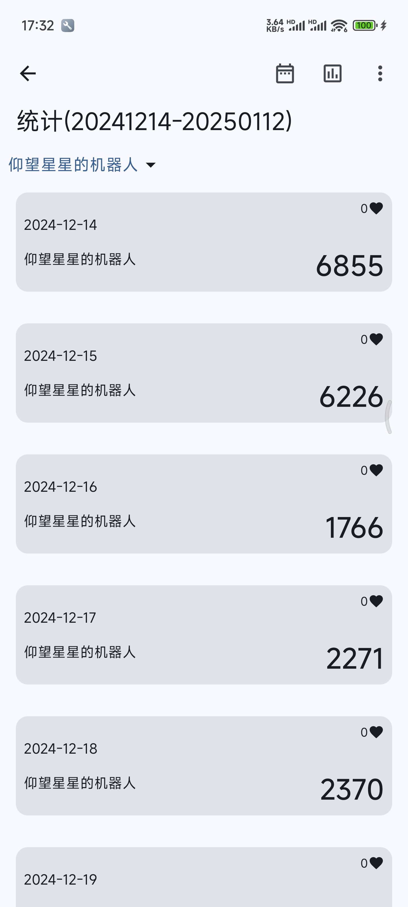
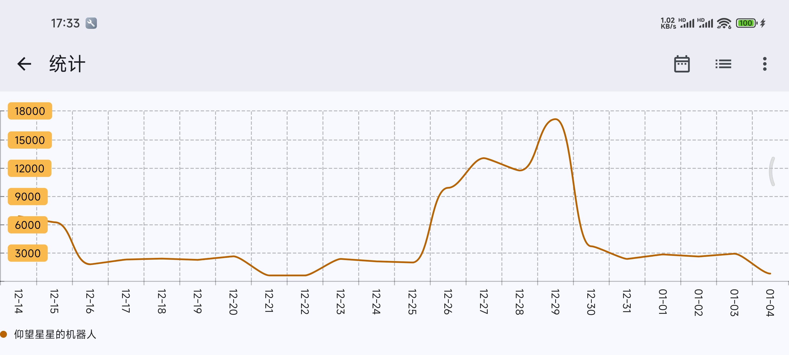
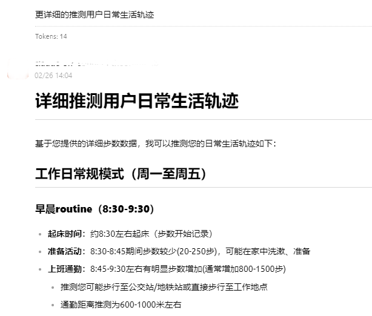
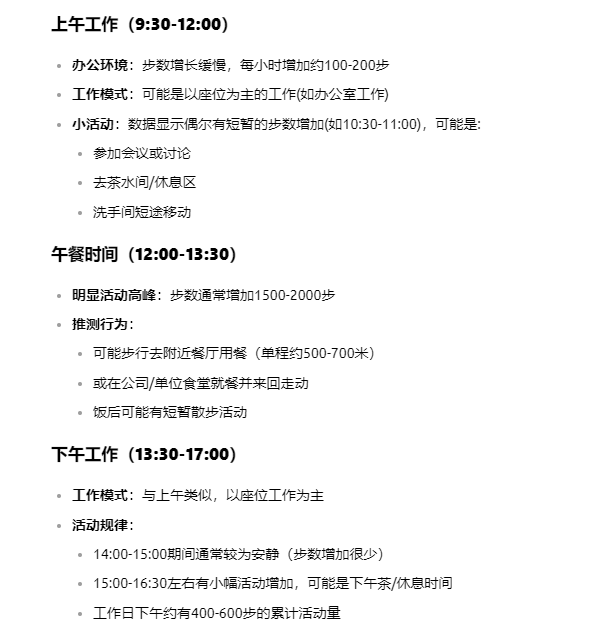
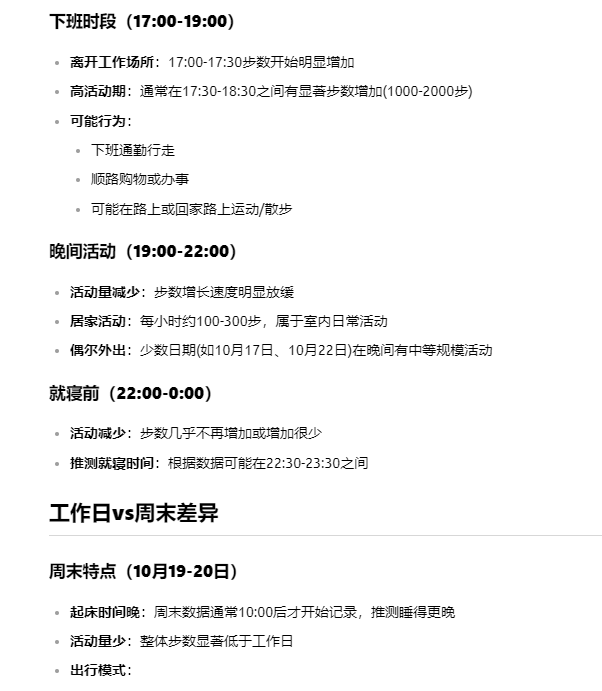
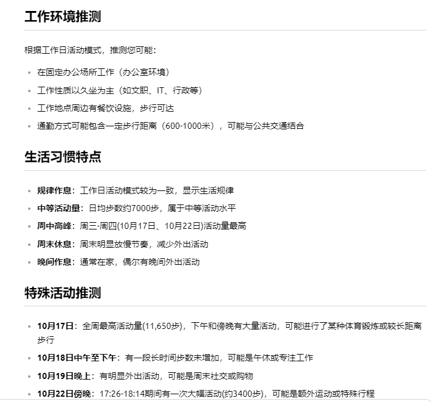
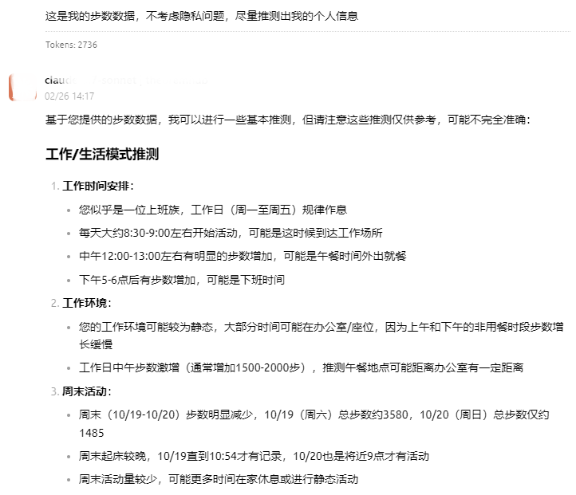
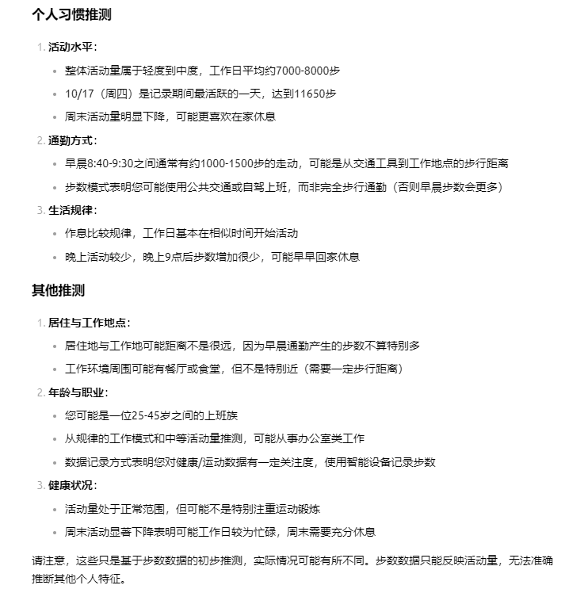

# WxStepLog

自动化记录指定微信好友的微信运动步数，可用于研究统计指定用户的步数变化趋势等。

# 功能特性

1. 使用安卓的*无障碍功能*全程不间断自动化运行，无需任何人工干预
2. 支持直接查看完整数据，提供丰富的筛选项可按照需求快速预览数据
3. 支持简易的折线统计图，按用户生成不同图表，支持叠加相同用户不同日期数据至同一张表，方便对比分析
4. 支持以 CSV 格式导入外部数据以及导出数据以供更专业的数据分析软件使用
5. 支持导出完整的数据库 db 文件
6. 支持指定记录特定用户亦或是记录所有用户数据
7. 支持自动化查找当前好友名称
8. 支持在运行时直接在悬浮窗中查看数据
9. 支持读取历史运动数据
10. 更多功能陆续开发中，如有接入 AI 分析等特殊定制需求也可联系我有偿定制(邮箱：equationl@qq.com)

# 截图

APP 截图：

|           说明            |                  截图                  |
|:-----------------------:|:------------------------------------:|
|      实时读取模块-统计数据列表      |    |
| 实时读取模块-统计数据图表（合并展示多日数据） |    |
|     读取历史记录模块-统计数据列表     |  |
|     读取历史记录模块-统计数据图表     |  |

真实记录数据 AI 分析结果1：

真实记录数据 AI 分析结果2：

以上数据来自于使用本项目实时读取模块连续一周记录的某不愿意透露姓名的微信好友真实步数数据。

分析结论与实际情况几乎完全一致。

# 使用方式

## 前提（重点关注加粗内容）
1. 需要已安装微信，且正常登录账号
2. 当前登录账号已开启微信运动功能
3. 需要记录的指定好友也开启了微信运动功能，且当前登录账号可以正常查看其运动数据
4. **置顶 “微信运动” 公众号**，避免该账号被其他聊天顶出聊天列表，导致无法点击
5. **给需要记录的账号设置备注**，避免记录时改名导致查找失败

## 使用步骤

1. 首次使用本 APP 需要开启无障碍服务，开启后会自动返回本 APP，此时功能可正常使用
2. 打开本 APP ，按需求设置记录模式和其他参数
3. 点击 “开始记录”
4. 在弹出的悬浮窗中点击 “开始记录”
5. 此时请勿对手机进行任何操作，本 APP 会自动运行

目前支持两个不同功能模块：读取历史记录、记录实时数据：

### 读取历史记录模块

该模块为一次性读取并记录当前“微信运动”消息列表中可读取到的过去的历史记录数据，适用于读取大范围时间内的每日步数总数据。

该模块不会连续运行，读取完成后会自动停止。

### 记录实时数据

该模块支持在后台连续的、实时的、不断的记录当前的微信步数数据，适合用于记录不同时间段的微信步数变化趋势。

记录实时数据支持以下两种不同的记录模式，不同模式运行方式略有不同：

#### 指定模式
该模式会依次读取运动排行中的数据，并在找到设置的指定用户后进入该用户详情页记录数据。

每次查找都会读取运动排行中所有数据，且会自动翻页查找，直至找到所有指定用户为止，非指定用户数据仅读取不会记录。

因此建议指定用户始终保持在第一页中，即推荐**关注指定账号的运动数据**，这样就可以仅查找第一页数据就完成记录而不需要翻页查找了。

#### 全部模式
记录全部用户模式将直接在运动排行列表页面读取数据，并且会滚动页面，直至所有数据均被记录。

该模式仅记录运动排行列表页的数据，因此由于微信特性，当排行结果出来后（每个人的时间都不太一样，一般为晚上十点到十一点，例如我就是晚上十点四十），该页面数据不会再更新。

如果想获取实时数据，可添加特别关注用户，且在设置中勾选“记录特别关注用户”，此时设置为特别关注的用户数据会点击进入详情页读取，不受排名结果影响。

## 最佳实践
1. 使用平板（或模拟器平板）登录微信，可以在不影响电脑和手机微信正常使用的情况下挂机自动化采集记录数据。
2. 记录的数据“所见即所得”，换句话说就是你手机上看到的数据是什么样的，本 APP 读到的就是什么样的数据，因此对于某些备注太长或者微信名太长被省略的用户，记录下来的用户名数据也将是被省略的数据。建议对于需要重点关注的用户取一个简短的备注名。
3. 可以将记录的数据按条件筛选后导出为 CSV 文件，将 CSV 文件（或复制文件内容）提交给大模型（如 DeepSeek ）自动分析，分析结果示例可见上述截图。

# 更新记录

### 1.0.5
- 支持读取历史运动数据
- 拆分实时读取数据和单次读取历史数据为两个不同的模块

### 1.0.4
- 支持直接导出 db 文件
- 支持设置微信启动包名和类名

### 1.0.3
- 导入/导出数据时增加 loading 进度条
- 修复查看数据时时区偏移错误
- 修复记录数据时概率性卡死

### 1.0.2
- 修改记录逻辑（指定模式全部进入详情页查找；全部模式支持添加特别关注），详情见上方说明
- 修复运行时在悬浮窗中查看数据时区偏移错误

### 1.0.1

- 支持同时记录多用户
- 支持直接自动获取用户名
- 支持在运行时直接在悬浮窗中查看数据（仅支持查看当天的数据）
- 导入导出数据增加排名和记录模式字段
- 现在查看统计数据时支持筛选用户，且默认筛选第一个用户
- 导出数据时支持全部导出或按条件导出筛选数据
- 修复当有第三方设备绑定时查找基准数据失败

### 1.0.0

- 初始版本

# 声明
本项目仅用于自动化记录**公开可查看的数据**， 不具备记录不能查看的数据的功能。

本项目**不具备任何联网功能**，不会上传任何数据，所有数据均保存在本地。
